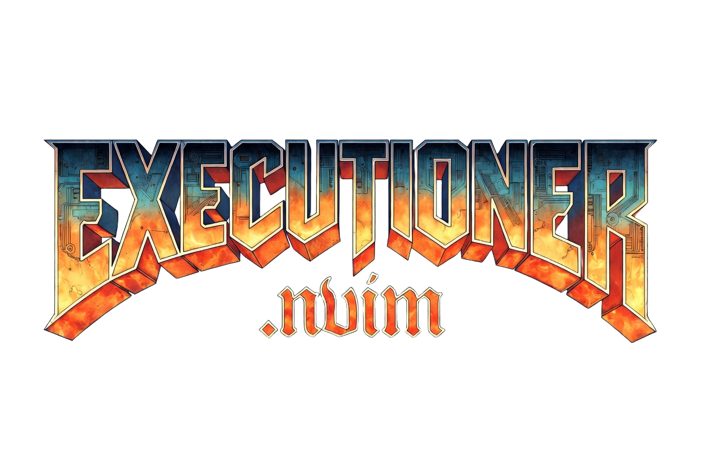
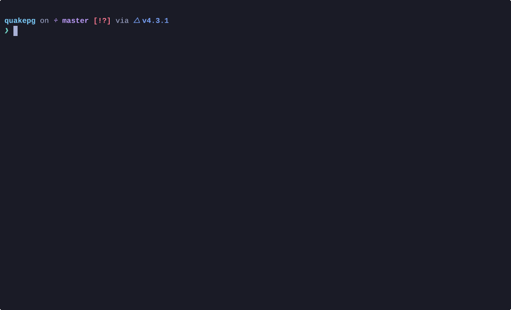

<div align="center">




Telescope-powered script runner & build system for Neovim 0.10+

[](https://opensource.org/licenses/MIT)
[](https://neovim.io)
[](https://luarocks.org/modules/sektant1/executioner.nvim)

Fuzzy find scripts or binaries in your project, pick one, and run it in a terminal buffer.
Configure, build, and pick targets from CMake, Make, and Meson projects.



</div>

## Features

- **Telescope picker** with fuzzy search and file preview
- **Auto-detection** by file extension or executable bit
- **Shebang support** executable files with shebangs run directly
- **Argument prompt** via `vim.ui.input` before execution
- **Args memory** last-used arguments per script are remembered across sessions
- **Quick rerun** `:ExecutionerRerun` re-runs the last script without the picker
- **Build systems** configure, build, and pick targets from CMake, Make, and Meson
- **Terminal modes** floating window, split, or toggleterm
- **Quick close** press `q` in the terminal buffer to close it
- **Configurable** extensions map, ignore patterns, recursive scan, depth limit
- **Lazy-loaded** nothing runs until you open the picker

## Requirements

- Neovim >= 0.10
- [telescope.nvim](https://github.com/nvim-telescope/telescope.nvim)
- [plenary.nvim](https://github.com/nvim-lua/plenary.nvim)

Optional:
- [toggleterm.nvim](https://github.com/akinsho/toggleterm.nvim) — only needed when `terminal.type = "toggleterm"`
- `cmake`, `make`, `meson`, `ninja` — for build system integration

## Installation

### lazy.nvim

```lua
{
  "sektant1/executioner.nvim",
  cmd = { "Executioner", "ExecutionerRerun",
          "ExecutionerConfigure", "ExecutionerBuild", "ExecutionerBuildLast" },
  keys = {
    -- you can change for whatever keybinds you want :)
    { "<leader>er", function() require("executioner").run_scripts() end, desc = "Executioner: run script" },
    { "<leader>eR", function() require("executioner").rerun() end, desc = "Executioner: rerun last script" },
    { "<leader>ec", function() require("executioner").configure() end, desc = "Executioner: configure project" },
    { "<leader>eb", function() require("executioner").build() end, desc = "Executioner: build target" },
    { "<leader>eB", function() require("executioner").build_last() end, desc = "Executioner: rerun last build" },
  },
  dependencies = {
    "nvim-telescope/telescope.nvim",
    "nvim-lua/plenary.nvim",
  },
  opts = {},
  config = function(_, opts)
    require("executioner").setup(opts)
    require("telescope").load_extension("executioner")
  end,
}
```

### packer.nvim

```lua
use {
  "sektant1/executioner.nvim",
  requires = {
    "nvim-telescope/telescope.nvim",
    "nvim-lua/plenary.nvim",
  },
  config = function()
    require("executioner").setup()
    require("telescope").load_extension("executioner")
  end,
}
```

### rocks.nvim
```vim
:Rocks install executioner.nvim
```

## Usage

### Running scripts

```vim
:Executioner
```

Or from Lua:

```lua
require("executioner").run_scripts()
```

Select a script, optionally enter arguments, and it runs in a terminal buffer.
The args prompt is pre-filled with the last-used arguments for that script.
Press `q` in the terminal buffer (normal mode) to close it.

To re-run the last script without the picker:

```vim
:ExecutionerRerun
```

### Build systems

executioner.nvim auto-detects CMake, Make, and Meson projects by looking for
`CMakeLists.txt`, `Makefile` (or `makefile`, `GNUmakefile`), and `meson.build`
in the current working directory.

**Configure** (CMake / Meson):

```vim
:ExecutionerConfigure
```

**Build a target** (opens a Telescope picker with discovered targets):

```vim
:ExecutionerBuild
```

You can also pass a target directly (with tab-completion):

```vim
:ExecutionerBuild myapp
```

**Re-run the last build:**

```vim
:ExecutionerBuildLast
```

| Command | Lua API | Description |
|---|---|---|
| `:Executioner` | `require("executioner").run_scripts()` | Pick and run a script |
| `:ExecutionerRerun` | `require("executioner").rerun()` | Rerun last script |
| `:ExecutionerConfigure` | `require("executioner").configure()` | Configure project |
| `:ExecutionerBuild [target]` | `require("executioner").build(nil, target)` | Build target (picker or direct) |
| `:ExecutionerBuildLast` | `require("executioner").build_last()` | Rerun last build |

#### How targets are discovered

| Build system | Method |
|---|---|
| CMake | Parsed from `cmake --build <dir> --target help` |
| Make | Parsed from `.PHONY` declarations and rule lines in the Makefile |
| Meson | Parsed from `meson introspect --targets <dir>` (JSON) |

## Configuration

Defaults are shown below.

```lua
require("executioner").setup({
  scripts_dir = ".",              -- string or function(): string
  recursive = true,
  max_depth = 3,
  ignore = { "node_modules", ".git", ".venv", "target", "dist" },
  include_executables = true,
  always_prompt_args = true,

  extensions = {
    sh   = "bash",
    bash = "bash",
    zsh  = "zsh",
    fish = "fish",
    py   = "python3",
    ps1  = "pwsh",
    lua  = "nvim -l",
    js   = "node",
    ts   = "tsx",
    rb   = "ruby",
    pl   = "perl",
    bat  = "cmd /c",
    cmd  = "cmd /c",
  },

  build = {
    cmake = {
      build_dir      = "build",       -- relative to cwd or absolute
      generator      = nil,           -- e.g. "Ninja" (nil = cmake default)
      configure_args = {},            -- extra args for cmake -B … -S …
      build_args     = {},            -- extra args for cmake --build …
    },
    make = {
      args = {},                      -- extra args passed before the target
    },
    meson = {
      build_dir    = "builddir",      -- relative to cwd or absolute
      setup_args   = {},              -- extra args for meson setup
      compile_args = {},              -- extra args for meson compile
    },
  },

  terminal = {
    type = "split",               -- "split" | "float" | "toggleterm"
    split = {
      direction = "belowright",
      size = 15,
      vertical = false,
    },
    float = {
      width  = 0.8,
      height = 0.8,
      border = "rounded",
      title  = " Executioner ",
    },
    auto_close   = false,
    start_insert = true,
  },

  telescope = {
    theme   = "dropdown",
    preview = true,
  },
  keymaps = { run = false },      -- set to e.g. "<leader>er" for a global mapping
  on_exit = nil,                  -- function(code, script_path)
})
```

## Recipes

### Run scripts from a `scripts/` directory

```lua
require("executioner").setup({
  scripts_dir = "scripts",
  recursive = true,
})
```

### Horizontal split instead of float

```lua
require("executioner").setup({
  terminal = { type = "split", split = { size = 20 } },
})
```

### Auto-close on success

```lua
require("executioner").setup({
  terminal = { auto_close = true },
})
```

### Add a custom extension

```lua
require("executioner").setup({
  extensions = { rs = "cargo run --" },
})
```

### Dynamic scripts directory

```lua
require("executioner").setup({
  scripts_dir = function()
    return vim.fn.getcwd() .. "/bin"
  end,
})
```

### Skip argument prompt

```lua
require("executioner").setup({
  always_prompt_args = false,
})
```

### CMake with Ninja and Release mode

```lua
require("executioner").setup({
  build = {
    cmake = {
      generator = "Ninja",
      configure_args = { "-DCMAKE_BUILD_TYPE=Release" },
      build_args = { "-j8" },
    },
  },
})
```

### Make with parallel jobs

```lua
require("executioner").setup({
  build = {
    make = { args = { "-j$(nproc)" } },
  },
})
```

### Meson with custom build type

```lua
require("executioner").setup({
  build = {
    meson = {
      setup_args = { "--buildtype=release" },
    },
  },
})
```

## Health Check

```vim
:checkhealth executioner
```

Verifies dependencies (telescope, plenary, toggleterm), Neovim version,
`scripts_dir` existence, common interpreter availability, and build tool
detection (cmake, make, meson, ninja).

## FAQ

**Q: How does executioner decide which interpreter to use?**
A: First it checks for a shebang (`#!`) + executable bit — if both exist, the file runs directly. Otherwise it looks up the file extension in the `extensions` map. Bare executables without a shebang or known extension also run directly.

**Q: Can I use this without Telescope?**
A: No. Telescope is a required dependency for the picker UI.

**Q: Does it work on Windows?**
A: The `bat` and `cmd` extensions map to `cmd /c`. Path handling uses `vim.fn.fnamemodify`. It should work for basic cases but is primarily tested on Unix.

**Q: How do I add support for a new language?**
A: Add the extension to the `extensions` table: `extensions = { go = "go run" }`.

**Q: How does build system detection work?**
A: executioner looks for `CMakeLists.txt`, `meson.build`, or `Makefile` (also `makefile` and `GNUmakefile`) in the current working directory. Priority is CMake > Meson > Make.

**Q: Do I need to run `:ExecutionerConfigure` before `:ExecutionerBuild`?**
A: For CMake and Meson, yes — the project must be configured first so the build directory exists. For Make, there is no configure step.

## Contributing

1. Fork the repo
2. Create a feature branch
3. Run tests: `make test` or `nvim --headless -u tests/minimal_init.lua -c "PlenaryBustedDirectory tests/ { minimal_init = 'tests/minimal_init.lua' }"`
4. Ensure `stylua` passes
5. Open a PR

## License

MIT
